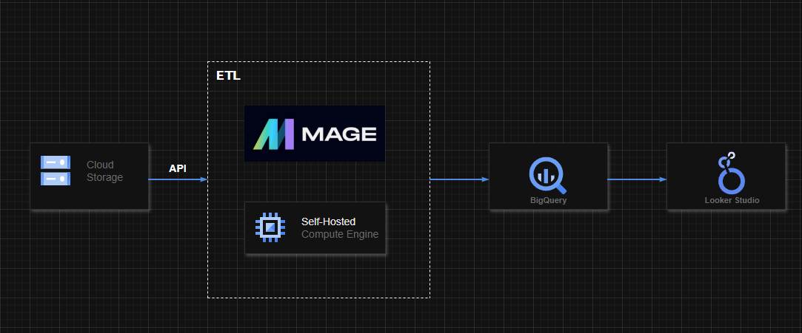
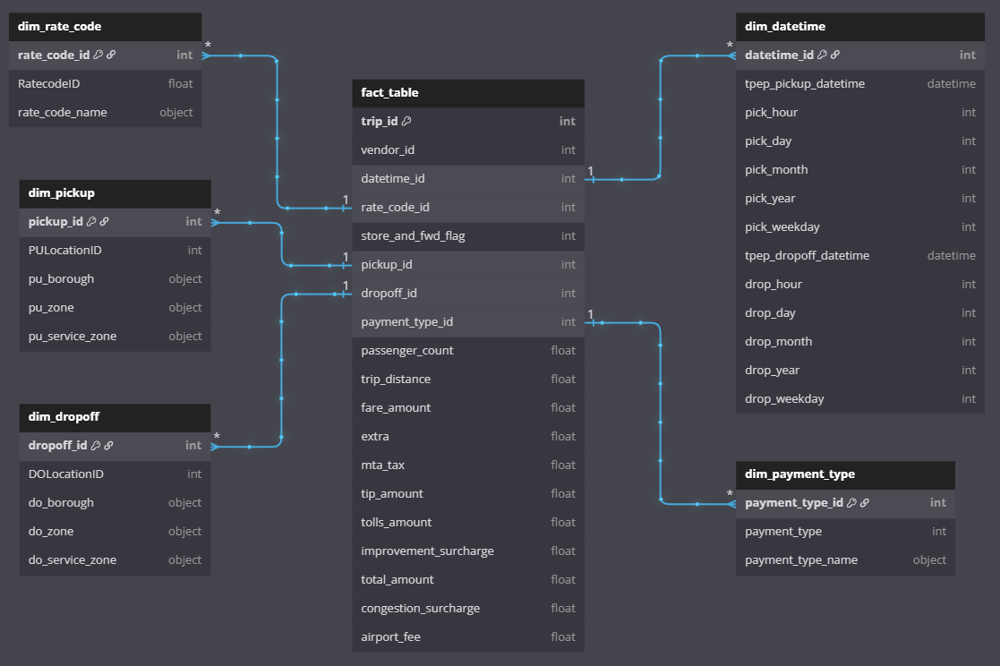
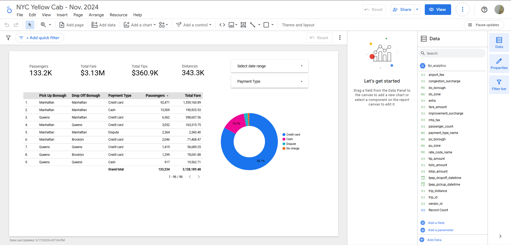

# TLC Yellow Cab Data Pipeline | Data Engineering Project on Windows

## Introduction

The goal of this project is to demonstrate an end-to-end workflow of Data Engineering, in which focuses on ETL process using various tools and technologies, including Google Cloud Storage, Docker, MageAI Data Pipeline Tool, BigQuery, and Looker Studio.

## Architecture 


## Technology Used
- [Programming Language - Python](https://www.python.org/downloads/)
- [Windows Subsystem for Linux (WSL)](https://learn.microsoft.com/en-us/windows/wsl/install)
- [Docker Desktop](https://www.docker.com/products/docker-desktop/)
- [Git for Windows](https://git-scm.com/)

Google Cloud Platform
- Google Cloud Storage - [example](./google_cloud_storage.png)
- Google BigQuery - [example](./bigquery.png)
- Looker Studio - [Link](./lookerstudio.png)

Modern Data Pipeine Tool - https://www.mage.ai/

How to self-host MageAI with Docker Desktop - https://docs.mage.ai/getting-started/setup#docker-compose


## Dataset Used
Yellow Taxi Trip Records of November 2024 - https://www.nyc.gov/site/tlc/about/tlc-trip-record-data.page

The data was sampled out from 1.3 million to a hundred thousand of records
```python
df = pd.read_parquet("yellow_tripdata_2024-11.parquet")
# Cleaning
df = df.dropna()
df = df.drop_duplicates()

# Sampling out the data
df = df.sample(n=100000, random_state=42)
df = df.reset_index(drop=True)
df['trip_id'] = df.index
```

The final dataset - https://storage.googleapis.com/tlc-yellow-2024-11-project/tlc_yellow_2024_11.parquet

More info about dataset can be found here:
1. Website - https://www.nyc.gov/site/tlc/about/tlc-trip-record-data.page
2. Data Dictionary - https://www.nyc.gov/assets/tlc/downloads/pdf/data_dictionary_trip_records_yellow.pdf
3. Zone Lookup Table - https://d37ci6vzurychx.cloudfront.net/misc/taxi_zone_lookup.csv

## Data Model


## Lookup Studio Dashboard
[The Dashboard](https://lookerstudio.google.com/reporting/e0e7f22b-9c7e-44dd-86d1-e1b93a54c563)


